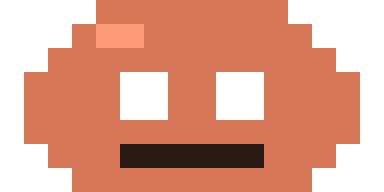
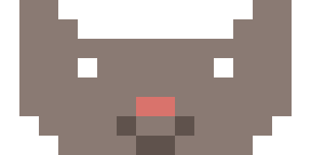
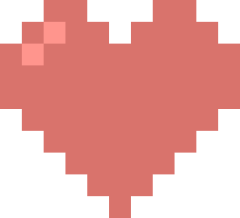

# unicode-sprite

Draw small pixel-art sprites that render in the terminal using Unicode block
characters and 24-bit ANSI color. The kind of little mascot a CLI prints in its
welcome banner.

It has two parts: an interactive in-terminal editor with mouse support, and a
CLI for scripted use (create, render, import, export, poke pixels, pipe it all
together).

<p>
  &nbsp;&nbsp;
  &nbsp;&nbsp;
  
</p>

The same three sprites as the terminal prints them (color stripped; in a real
terminal every block is colored):

```
 ▗▀███▖      ▐▙    ▟▌     ▄▀█▄ ▄██▄
▗█▛▜▛▜█▖     ▐█▜██▛█▌     █▀█████████
▐█▙▟▙▟█▌     ▐██▛▜██▌     ▀█████████▀
 ▜▙▀▀▟▛       ▜█▚▚█▛        ▀█████▀
                              ▀█▀
```

## Install

Requires Node 20 or newer.

```bash
npm install
npm run build
npm link        # puts `unicode-sprite` (and the short alias `usprite`) on your PATH
```

Or run straight from the source tree without building:

```bash
npm run dev -- render examples/cat.sprite.json
```

## How rendering works

A sprite is a grid of pixels. Each terminal cell holds several pixels using
block characters, so drawing resolution is finer than the character grid.

| Mode       | Pixels per cell | Characters                      | Colors per cell |
| ---------- | --------------- | ------------------------------- | --------------- |
| `half`     | 1 wide × 2 tall | `▀ ▄ █` and space               | any two         |
| `quadrant` | 2 wide × 2 tall | `▘ ▝ ▖ ▗ ▀ ▄ ▌ ▐ ▚ ▞ ▛ ▜ ▙ ▟ █` | two, or one + transparent |

A cell can only show a foreground and a background color. In quadrant mode,
when a cell would need three or more colors, the two most common win and the
rest snap to the nearest of those in OKLab distance. The editor marks such
cells with `×` in the zoom view so you can fix them. A cell that contains a
transparent pixel can show only one color.

Transparent pixels emit no background code, so your terminal background shows
through. That is how holes like eyes are made.

Output uses truecolor escapes (`ESC[38;2;R;G;Bm` / `ESC[48;2;R;G;Bm`), always
reset with `ESC[0m`, and falls back to the nearest xterm-256 color when
`COLORTERM` does not indicate truecolor. Force a mode with `--color truecolor`
or `--color 256`.

## Palette

The baseline is Claude orange `#D77757`. Every other hue is that color
converted to OKLCH with its lightness and chroma kept and only the hue rotated,
so the whole set shares the same warmth and weight. Each hue comes in five
steps (two tints, base, two shades) and there is a warm neutral row. Colors
that fall outside sRGB are brought back by reducing chroma, never by clipping
channels.

```bash
unicode-sprite palette
```

Names: `red orange amber yellow lime green teal cyan blue indigo purple pink`,
each with `-200 -300` (lighter) and `-600 -700` (darker) variants, plus
`neutral-1` (off-white) through `neutral-8` (near-black). Anywhere a color is
accepted you can use a palette name or a hex value.

The palette lives in one file, [src/core/palette.ts](src/core/palette.ts), if
you want to tweak hue angles or lightness steps.

## The editor

```bash
unicode-sprite edit mascot.sprite.json              # creates the file if missing
unicode-sprite edit mascot.sprite.json -W 24 -H 12 -m half
```

The screen shows the sprite at real terminal size (the preview), a zoomed view
where each pixel is a larger block for precise editing, the palette grid with
the current color highlighted, and a status bar with the tool, color, cursor,
canvas size, render mode, and an unsaved-changes marker.

**Mouse**

| Action                          | Effect                              |
| ------------------------------- | ----------------------------------- |
| Left click or drag in the zoom  | Paint with the current tool         |
| Right click or drag in the zoom | Erase                               |
| Middle click                    | Eyedropper                          |
| Click a palette swatch          | Select that color                   |
| Click the preview               | Move the cursor to that cell        |
| Scroll wheel                    | Cycle through the palette           |

One click-and-drag stroke is a single undo step.

**Keyboard**

| Key                              | Effect                                   |
| -------------------------------- | ---------------------------------------- |
| `p` `e` `i`                      | Pencil, eraser, eyedropper               |
| arrows or `h` `j` `k` `l`        | Move the cursor                          |
| `space` or `enter`               | Apply the current tool at the cursor     |
| `backspace` `delete` `x`         | Erase at the cursor                      |
| `[` `]`                          | Previous / next palette color            |
| `#` or `c`                       | Enter a custom hex value or palette name |
| `u` or `ctrl+z`                  | Undo                                     |
| `ctrl+y`, `Z`, or `ctrl+shift+z` | Redo                                     |
| `s` or `ctrl+s`                  | Save                                     |
| `q` or `ctrl+c`                  | Quit (asks if there are unsaved changes) |
| `r`                              | Resize the canvas                        |
| `m`                              | Toggle half / quadrant mode              |
| `z`, `+`, `-`                    | Toggle the zoom view, zoom in, zoom out  |
| `t`                              | Toggle the palette panel                 |
| `?`                              | Help overlay                             |

Most terminals send `ctrl+shift+z` and `ctrl+z` as the same byte, so `Z` is
the dependable redo key. Terminals with the kitty keyboard protocol get the
real `ctrl+shift+z`.

History holds 200 steps.

## CLI

Every command has `--help`. Commands read from stdin and write to stdout when
no file is given, so they can be piped together.

```bash
# create
unicode-sprite new mascot.sprite.json --width 16 --height 8 --mode quadrant

# look at it
unicode-sprite render mascot.sprite.json
unicode-sprite render mascot.sprite.json --color 256

# poke pixels (palette names or hex; edits the file in place)
unicode-sprite set mascot.sprite.json 3 2 orange
unicode-sprite set mascot.sprite.json 4 2 "#2a1a14"
unicode-sprite clear mascot.sprite.json 3 2

# pipeline: build a sprite without touching the disk
unicode-sprite new -W 4 -H 4 | unicode-sprite set 0 0 orange | unicode-sprite set 3 3 blue | unicode-sprite render

# export
unicode-sprite export mascot.sprite.json --format ansi -o mascot.ans     # `cat mascot.ans` shows it
unicode-sprite export mascot.sprite.json --format sh   -o mascot.sh      # printf script
unicode-sprite export mascot.sprite.json --format js   -o mascot.js      # export const MASCOT = ...
unicode-sprite export mascot.sprite.json --format ts   --var-name banner
unicode-sprite export mascot.sprite.json --format py   -o mascot.py      # MASCOT = "\n".join([...])
unicode-sprite export mascot.sprite.json --format png  -o mascot.png --scale 16 --background "#ffffff"
unicode-sprite export mascot.sprite.json --format html -o mascot.html    # <pre> with colored spans
unicode-sprite export mascot.sprite.json --format txt                    # block characters, no color

# import
unicode-sprite import logo.png --width 24 -o logo.sprite.json            # snaps to the palette
unicode-sprite import logo.png --width 24 --keep-colors --alpha 64       # keep original colors
unicode-sprite import banner.ans -o banner.sprite.json                   # parse block chars + SGR codes back

# palette swatches with hex codes and names
unicode-sprite palette
unicode-sprite palette --json
```

The `import` command detects PNG by its signature and treats anything else as
ANSI text. It parses 24-bit, 256-color, and basic 16-color SGR codes. Half or
quadrant mode is guessed from the characters present, or forced with `--mode`.

## File format

The native format is readable JSON. Rows are strings of space-separated
tokens, `-` means transparent, and tokens can be hex values, palette names, or
keys from the file's own `palette` map.

```json
{
  "version": 1,
  "name": "blob",
  "width": 16,
  "height": 8,
  "mode": "quadrant",
  "palette": { "o": "#d77757", "k": "#2a1a14" },
  "pixels": [
    "- - - - o o o o o o o o - - - -",
    "- o o o o - - o o - - o o o o -",
    "..."
  ]
}
```

Rows may also be written as JSON arrays with `null` for transparent.

## Claude Code plugin

`plugin/` is a Claude Code plugin, `sprite-party`, that turns the session's
subagents into a party of these sprites: a `Party` pane shows each subagent as one of the seven
rainbow mascots (crab, lemon, clover, diamond, rocket, crown, bunny) with its
mission, current move, HP (context left), MP (moves taken) and a guild of XP
that outlives the session. `/party` opens the pane.

To install it for yourself, copy the `plugin/` folder to
`~/.claude/skills/claude-code-sprites/` and start a new session:

```bash
git clone https://github.com/netzon-jlaw/claude-code-sprites.git /tmp/claude-code-sprites
cp -R /tmp/claude-code-sprites/plugin ~/.claude/skills/claude-code-sprites
```

For a repository, copy it to `<repo>/.claude/skills/claude-code-sprites/` and
commit it. For one session, `claude --plugin-dir path/to/plugin`. The sprites
are compiled from `examples/` by `node plugin/scripts/build-sprites.mjs`. See
[plugin/README.md](plugin/README.md) for the full guide.

## Development

```bash
npm test            # vitest: palette, every quadrant combination, cell resolution,
                    # undo/redo, JSON -> ANSI -> JSON round trip, editor harness
npm run typecheck
npm run build
```

Layout:

```
src/core      color math, palette, sprite model, block tables, cell resolution, renderer, history
src/import    png, ansi
src/export    ansi, sh, js/ts, py, png, html, txt
src/editor    raw terminal layer, editor state, view, event loop
src/cli       commander entry point and stdin/stdout helpers
examples      cat, heart, ten multicolor (ghost, robot, frog, octopus, mushroom, dragon, owl, ufo,
              skull, fox), seven more characters (axolotl, cyclops, jellyfish, onigiri, penguin,
              snowman, unicorn), and a rainbow of flat two-color mascots, one per hue (crab red,
              lemon yellow, clover green, diamond blue, rocket indigo, crown violet, bunny pink,
              plus cactus and duck)
```

## License

MIT
